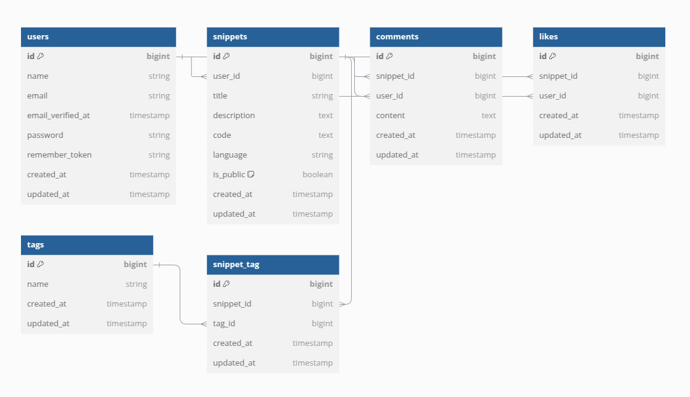

# Documentación de la base de datos

Usando la herramienta de modelado de base de datos [dbdiagram.io](https://dbdiagram.io/) se planteo el siguiente esquema:

Preview del esquema:

codigo:

```
Table users {
  id bigint [pk, increment]
  name string
  email string [unique]
  email_verified_at timestamp [null]
  password string
  remember_token string [null]
  created_at timestamp
  updated_at timestamp
}

Table snippets {
  id bigint [pk, increment]
  user_id bigint [ref: > users.id]
  title string
  description text [null]
  code text
  language string
  is_public boolean [default: false]
  created_at timestamp
  updated_at timestamp
}

Table comments {
  id bigint [pk, increment]
  snippet_id bigint [ref: > snippets.id]
  user_id bigint [ref: > users.id]
  content text
  created_at timestamp
  updated_at timestamp
}

Table likes {
  id bigint [pk, increment]
  snippet_id bigint [ref: > snippets.id]
  user_id bigint [ref: > users.id]
  created_at timestamp
  updated_at timestamp
}

Table tags {
  id bigint [pk, increment]
  name string [unique]
  created_at timestamp
  updated_at timestamp
}

Table snippet_tag {
  id bigint [pk, increment]
  snippet_id bigint [ref: > snippets.id]
  tag_id bigint [ref: > tags.id]
  created_at timestamp
  updated_at timestamp
}
```
